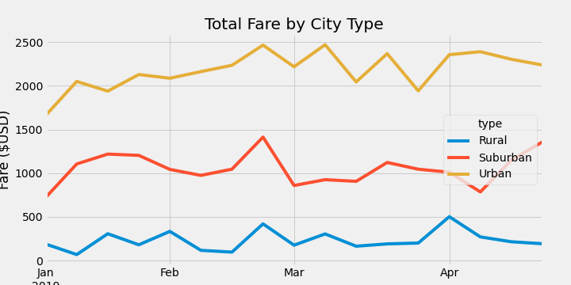
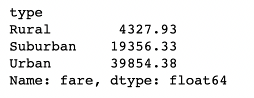
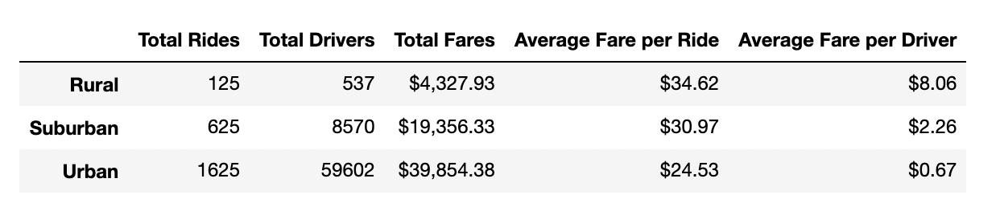

# PyBer_Analysis
## Overview of the analysis
The purpose of this analysis was to do a deeper analysis on Pyber rideshare data: specifically, grouped by type of city (urban, suburban, or rural) to compare certain metrics. By doing so, we will be able to provide findings and recommendations to the PyBer team.
## Results: Using images from the summary DataFrame and multiple-line chart, describe the differences in ride-sharing data among the different city types.
##### Total Fare by City Type

To come to these results, we grouped the data by city type, found the total fares for each, then charted them in a time line chart, which captured about a half a year of data. From this chart we can draw some obvious conclusions:
- Urban fares are the highest
- Surburban fares are second
- Rural fares are the lowest

This is consistent with what common sense dictates, that less people per capita means less people needing rides, and less business for a rideshare company. The rural share in the beginning was close to 0! This tells us that we should focus our efforts on the higher earning markets, urban and suburban.
Please find additional results below.

Total Rides 

Total Drivers 

Total Fares 

Average Fare per Ride 

Average Fare per Driver

Total fare by City Type

##### Final Summary Table

## Summary
Here are three recommentations for the CEO based on my findings:
1. The urban market seems to sustain itself quite well without need for additional effort. We could take another look at the resources allocated to this market, and re-distribute them places that could be improved. For example...
2. The suburban market is successful, but could it be more? We could re-divert some resources in search of getting more rides there. Don't overlook this group just because it's so steadily profitable.
3. There are a lot of unanswered questions about the rural demographic. I would recommend a study into making sure we can't bump up those numbers. They increased from near 0 to $500 total from January to April; what was the cause of that? The answers we find may allow us to adjust our approach, and make more revenue in a historically not so profitable market. 